# 📊 Diagramas y Ejemplos Prácticos - Módulo de Autenticación

## 📋 Contenido

1. [Diagramas de Flujo](#diagramas-de-flujo)
2. [Ejemplos de Uso](#ejemplos-de-uso)
3. [Casos de Prueba](#casos-de-prueba)
4. [Troubleshooting](#troubleshooting)

---

## 📈 Diagramas de Flujo

### 1. Flujo Completo de Registro


### 2. Flujo de Login


### 3. Flujo de Validación de Access Token


### 4. Flujo de Refresh Token

```mermaid
sequenceDiagram
    participant Client
    participant Controller
    participant RefreshGuard
    participant TokenService
    participant Redis

    Client->>RefreshGuard: POST /refresh-token + Bearer {refreshToken}

    RefreshGuard->>JwtService: verifyAsync(token, secret, HS256)
    alt Token Invalid
        JwtService-->>RefreshGuard: Error
        RefreshGuard-->>Client: 401 Unauthorized
    end
    JwtService-->>RefreshGuard: payload
    RefreshGuard->>RefreshGuard: request.user = payload
    RefreshGuard-->>Controller: true

    Controller->>TokenService: refreshToken(request)
    TokenService->>Redis: get(auth:refresh:{userId})

    alt Token Not Found
        Redis-->>TokenService: null
        TokenService-->>Controller: 401 Token inválido
    end

    alt Token Mismatch
        Redis-->>TokenService: differentToken
        TokenService-->>Controller: 401 Token inválido
    end

    Redis-->>TokenService: storedToken
    TokenService->>TokenService: setAccessToken()
    TokenService->>Redis: set(auth:access:{newTokenId}, "valid", 15m)
    TokenService-->>Controller: newAccessToken

    Controller-->>Client: 200 OK + { accessToken, refreshToken, user }
```



### 5. Flujo de Logout

```mermaid
sequenceDiagram
    participant Client
    participant Controller
    participant AccessGuard
    participant AuthService
    participant Redis

    Client->>AccessGuard: POST /logout + Bearer {accessToken}
    AccessGuard->>AccessGuard: Validate token
    AccessGuard-->>Controller: Authorized

    Controller->>AuthService: logout(userId, accessToken)

    AuthService->>Redis: del(auth:refresh:{userId})
    Redis-->>AuthService: OK

    AuthService->>JwtService: verifyAsync(accessToken)
    JwtService-->>AuthService: payload { tokenId }

    AuthService->>Redis: del(auth:access:{tokenId})
    Redis-->>AuthService: OK

    AuthService-->>Controller: true
    Controller-->>Client: 200 Ha cerrado sesión
```



---

## 💡 Ejemplos de Uso

### 1. Proteger un Endpoint Simple

```typescript
import { Controller, Get, Req } from "@nestjs/common";
import { AuthRequired } from "@/common/decorators/authRequired.decorator";
import { Request } from "express";

@Controller("profile")
export class ProfileController {
  @AuthRequired()
  @Get()
  async getProfile(@Req() req: Request) {
    const userId = req.user!.sub;
    const email = req.user!.email;

    return {
      userId,
      email,
      message: "Perfil del usuario autenticado"
    };
  }
}
```

### 2. Verificar Permisos Específicos

```typescript
import { Controller, Post, Req, ForbiddenException } from "@nestjs/common";
import { AuthRequired } from "@/common/decorators/authRequired.decorator";
import { Request } from "express";

@Controller("admin")
export class AdminController {
  @AuthRequired()
  @Post("delete-user")
  async deleteUser(@Req() req: Request, @Body() dto: { userId: number }) {
    const permissions = req.user!.permissions;

    // Verificar permiso específico
    if (!permissions.includes("users.delete")) {
      throw new ForbiddenException("No tienes permiso para eliminar usuarios");
    }

    // Lógica de eliminación...
    return { message: "Usuario eliminado" };
  }
}
```

### 3. Guard Personalizado con Permisos

```typescript
// permission.guard.ts
import { Injectable, CanActivate, ExecutionContext, ForbiddenException } from "@nestjs/common";
import { Reflector } from "@nestjs/core";

export const PERMISSIONS_KEY = "permissions";
export const RequirePermissions = (...permissions: string[]) =>
  SetMetadata(PERMISSIONS_KEY, permissions);

@Injectable()
export class PermissionGuard implements CanActivate {
  constructor(private reflector: Reflector) {}

  canActivate(context: ExecutionContext): boolean {
    const requiredPermissions = this.reflector.getAllAndOverride<string[]>(PERMISSIONS_KEY, [
      context.getHandler(),
      context.getClass()
    ]);

    if (!requiredPermissions) {
      return true; // No se requieren permisos específicos
    }

    const request = context.switchToHttp().getRequest();
    const user = request.user;

    if (!user || !user.permissions) {
      throw new ForbiddenException("No tienes permisos suficientes");
    }

    const hasPermission = requiredPermissions.every((permission) =>
      user.permissions.includes(permission)
    );

    if (!hasPermission) {
      throw new ForbiddenException("No tienes permisos suficientes");
    }

    return true;
  }
}
```

**Uso:**

```typescript
@Controller("users")
export class UsersController {
  @AuthRequired()
  @RequirePermissions("users.read")
  @Get()
  async getUsers() {
    // Solo usuarios con permiso 'users.read' pueden acceder
  }

  @AuthRequired()
  @RequirePermissions("users.create")
  @Post()
  async createUser(@Body() dto: CreateUserDto) {
    // Solo usuarios con permiso 'users.create' pueden acceder
  }

  @AuthRequired()
  @RequirePermissions("users.update", "users.admin")
  @Put(":id")
  async updateUser(@Param("id") id: string) {
    // Requiere ambos permisos: 'users.update' Y 'users.admin'
  }
}
```

### 4. Obtener Información del Usuario en un Service

```typescript
import { Injectable, Inject, Scope } from "@nestjs/common";
import { REQUEST } from "@nestjs/core";
import { Request } from "express";

@Injectable({ scope: Scope.REQUEST })
export class MyService {
  constructor(@Inject(REQUEST) private request: Request) {}

  async doSomething() {
    // Acceder al usuario autenticado desde cualquier parte del servicio
    const userId = this.request.user?.sub;
    const userRole = this.request.user?.role;

    if (!userId) {
      throw new Error("Usuario no autenticado");
    }

    // Usar userId en la lógica...
  }
}
```

### 5. Login desde el Frontend (React/Next.js)

```typescript
// api/auth.ts
interface LoginCredentials {
  value1: string; // email
  value2: string; // password
}

interface LoginResponse {
  statusCode: number;
  message: string;
  data: {
    accessToken: string;
    refreshToken: string;
    user: {
      email: string;
      isVerified: boolean;
      name: string;
      picture: string | null;
      role: string;
    };
    permissions: string[];
  };
}

export async function login(credentials: LoginCredentials): Promise<LoginResponse> {
  const response = await fetch("http://localhost:3001/login", {
    method: "POST",
    headers: {
      "Content-Type": "application/json"
    },
    body: JSON.stringify(credentials)
  });

  if (!response.ok) {
    const error = await response.json();
    throw new Error(error.message || "Error al iniciar sesión");
  }

  const data = await response.json();

  // Guardar tokens en localStorage o cookies
  localStorage.setItem("accessToken", data.data.accessToken);
  localStorage.setItem("refreshToken", data.data.refreshToken);
  localStorage.setItem("user", JSON.stringify(data.data.user));

  return data;
}

export async function logout(): Promise<void> {
  const token = localStorage.getItem("accessToken");

  await fetch("http://localhost:3001/logout", {
    method: "POST",
    headers: {
      Authorization: `Bearer ${token}`
    }
  });

  // Limpiar localStorage
  localStorage.removeItem("accessToken");
  localStorage.removeItem("refreshToken");
  localStorage.removeItem("user");
}

export async function refreshAccessToken(): Promise<string> {
  const refreshToken = localStorage.getItem("refreshToken");

  const response = await fetch("http://localhost:3001/refresh-token", {
    method: "POST",
    headers: {
      Authorization: `Bearer ${refreshToken}`
    }
  });

  if (!response.ok) {
    // Refresh token inválido, hacer logout
    await logout();
    throw new Error("Sesión expirada");
  }

  const data = await response.json();
  localStorage.setItem("accessToken", data.data.accessToken);

  return data.data.accessToken;
}

// Interceptor para requests autenticados
export async function authenticatedFetch(url: string, options: RequestInit = {}): Promise<Response> {
  let token = localStorage.getItem("accessToken");

  const response = await fetch(url, {
    ...options,
    headers: {
      ...options.headers,
      Authorization: `Bearer ${token}`
    }
  });

  // Si el token expiró, refrescar y reintentar
  if (response.status === 401) {
    token = await refreshAccessToken();

    return fetch(url, {
      ...options,
      headers: {
        ...options.headers,
        Authorization: `Bearer ${token}`
      }
    });
  }

  return response;
}
```

---

## 🧪 Casos de Prueba

### 1. Test de Registro

```typescript
// auth.controller.spec.ts
import { Test, TestingModule } from "@nestjs/testing";
import { AuthController } from "./auth.controller";
import { CommandBus } from "@nestjs/cqrs";

describe("AuthController - Register", () => {
  let controller: AuthController;
  let commandBus: CommandBus;

  beforeEach(async () => {
    const module: TestingModule = await Test.createTestingModule({
      controllers: [AuthController],
      providers: [
        {
          provide: CommandBus,
          useValue: {
            execute: jest.fn()
          }
        }
      ]
    }).compile();

    controller = module.get<AuthController>(AuthController);
    commandBus = module.get<CommandBus>(CommandBus);
  });

  it("should register a new user", async () => {
    const authDto = {
      firstName: "Juan",
      lastName1: "Pérez",
      dui: "12345678-9",
      email: "juan@example.com",
      passwd: "SecurePass123!"
      // ... otros campos
    };

    const expectedResponse = {
      statusCode: 201,
      message: "Usuario registrado exitosamente"
    };

    jest.spyOn(commandBus, "execute").mockResolvedValue(expectedResponse);

    const result = await controller.register(authDto);

    expect(commandBus.execute).toHaveBeenCalledWith(
      expect.objectContaining({
        data: authDto
      })
    );
    expect(result).toEqual(expectedResponse);
  });

  it("should throw error for duplicate email", async () => {
    const authDto = {
      email: "existing@example.com"
      // ... otros campos
    };

    jest
      .spyOn(commandBus, "execute")
      .mockRejectedValue(
        new ForbiddenException("Este correo electrónico ya está asociado a una cuenta.")
      );

    await expect(controller.register(authDto)).rejects.toThrow(ForbiddenException);
  });
});
```

### 2. Test de Login

```typescript
describe("AuthController - Login", () => {
  it("should login successfully with valid credentials", async () => {
    const loginDto = {
      value1: "user@example.com",
      value2: "Password123!"
    };

    const mockUser = {
      id: 1,
      email: "user@example.com",
      passwd: "hashedPassword",
      roleId: 1,
      Role: { id: 1, name: "User" }
    };

    const mockPermissions = ["read", "write"];

    jest
      .spyOn(queryBus, "execute")
      .mockResolvedValueOnce(mockUser)
      .mockResolvedValueOnce(mockPermissions);

    jest.spyOn(authService, "verifyPasswd").mockResolvedValue();
    jest.spyOn(tokenService, "generateTokens").mockResolvedValue({
      accessToken: "access_token",
      refreshToken: "refresh_token",
      user: {
        email: "user@example.com",
        isVerified: true,
        name: "User",
        picture: null,
        role: "User"
      },
      permissions: mockPermissions
    });

    const result = await controller.login(loginDto);

    expect(result.statusCode).toBe(200);
    expect(result.data.accessToken).toBe("access_token");
  });

  it("should fail login with invalid password", async () => {
    const loginDto = {
      value1: "user@example.com",
      value2: "WrongPassword"
    };

    const mockUser = {
      id: 1,
      email: "user@example.com",
      passwd: "hashedPassword"
    };

    jest.spyOn(queryBus, "execute").mockResolvedValue(mockUser);
    jest
      .spyOn(authService, "verifyPasswd")
      .mockRejectedValue(new UnauthorizedException("Credenciales incorrectas"));

    await expect(controller.login(loginDto)).rejects.toThrow(UnauthorizedException);
  });
});
```

### 3. Test de AccessTokenGuard

```typescript
describe("AccessTokenGuard", () => {
  let guard: AccessTokenGuard;
  let jwtService: JwtService;
  let redisService: RedisService;

  beforeEach(() => {
    jwtService = new JwtService({});
    redisService = new RedisService();
    guard = new AccessTokenGuard(jwtService, new Reflector(), redisService, configService);
  });

  it("should allow access with valid token", async () => {
    const mockContext = createMock<ExecutionContext>();
    const mockRequest = {
      headers: {
        authorization: "Bearer valid_token"
      }
    };

    mockContext.switchToHttp().getRequest.mockReturnValue(mockRequest);

    jest.spyOn(jwtService, "verifyAsync").mockResolvedValue({
      sub: 1,
      email: "user@example.com",
      tokenId: "token_id"
    });

    jest.spyOn(redisService, "get").mockResolvedValue("valid");

    const result = await guard.canActivate(mockContext);

    expect(result).toBe(true);
    expect(mockRequest["user"]).toBeDefined();
  });

  it("should deny access with missing token", async () => {
    const mockContext = createMock<ExecutionContext>();
    const mockRequest = {
      headers: {}
    };

    mockContext.switchToHttp().getRequest.mockReturnValue(mockRequest);

    await expect(guard.canActivate(mockContext)).rejects.toThrow(UnauthorizedException);
  });
});
```

---

## 🔧 Troubleshooting

### Problema 1: "No autorizado" al hacer request

**Síntomas:**

- 401 Unauthorized en requests protegidos
- Token parece válido

**Diagnóstico:**

```bash
# 1. Verificar que el token está en Redis
redis-cli
> GET "auth:access:{tokenId}"
# Debería retornar "valid"

# 2. Verificar expiración del token
# Decodificar el JWT en jwt.io
# Verificar que 'exp' no haya pasado

# 3. Verificar claves RSA
ls -la keys/jwt/
# Deben existir private.key y public.key
```

**Soluciones:**

```typescript
// Si el token no está en Redis, hacer login de nuevo
// Si las claves no existen, generarlas:

import * as crypto from "crypto";
import * as fs from "fs";

const { publicKey, privateKey } = crypto.generateKeyPairSync("rsa", {
  modulusLength: 2048,
  publicKeyEncoding: { type: "spki", format: "pem" },
  privateKeyEncoding: { type: "pkcs8", format: "pem" }
});

fs.writeFileSync("./keys/jwt/private.key", privateKey);
fs.writeFileSync("./keys/jwt/public.key", publicKey);
```

### Problema 2: Código de verificación no funciona

**Síntomas:**

- "Código de verificación incorrecto o expirado"
- El código es correcto

**Diagnóstico:**

```bash
redis-cli
> KEYS "verifyEmailCode*"
# Verificar que existe la clave

> GET "verifyEmailCode:{userId}"
# Verificar el código almacenado

> TTL "verifyEmailCode:{userId}"
# Verificar tiempo restante (en segundos)
```

**Solución:**

```typescript
// Si la clave no existe o expiró, reenviar el código
@Post('resend-verification')
async resendVerification(@Body() data: { email: string }) {
  const user = await this.findUserByEmail(data.email);
  await this.authService.sendVerificationEmail(user.id, user.email, 'password');
}
```

### Problema 3: Refresh token no funciona

**Síntomas:**

- "Token de sesión es inválido o ha expirado"

**Diagnóstico:**

```bash
redis-cli
> GET "auth:refresh:{userId}"
# Debe retornar el refresh token

> TTL "auth:refresh:{userId}"
# Verificar tiempo restante
```

**Solución:**

```typescript
// Hacer login de nuevo para obtener nuevos tokens
```

### Problema 4: "Cuenta bloqueada"

**Síntomas:**

- Usuario no puede hacer login después de múltiples intentos

**Diagnóstico:**

```bash
redis-cli
> GET "login:locked:{email}"
# Si retorna "locked", la cuenta está bloqueada

> TTL "login:locked:{email}"
# Tiempo restante del bloqueo
```

**Solución:**

```bash
# Opción 1: Esperar a que expire (15 minutos por defecto)

# Opción 2: Desbloquear manualmente
redis-cli
> DEL "login:locked:user@example.com"
> DEL "login:attempts:user@example.com"
```

### Problema 5: Permisos no se actualizan

**Síntomas:**

- Cambios en permisos de rol no se reflejan

**Causa:**

- Los permisos están en el access token
- El token no expira hasta 15 minutos después

**Solución:**

```typescript
// 1. Forzar logout del usuario
await this.authService.logout(userId, accessToken);

// 2. Usuario debe hacer login de nuevo

// 3. O implementar invalidación de tokens:
async invalidateAllUserTokens(userId: number): Promise<void> {
  // Buscar todos los tokens del usuario en Redis
  const pattern = `auth:access:*`;
  const keys = await this.redisService.keys(pattern);

  for (const key of keys) {
    const tokenData = await this.redisService.get(key);
    const payload = this.jwtService.decode(tokenData);

    if (payload && payload.sub === userId) {
      await this.redisService.del(key);
    }
  }

  // También invalidar refresh token
  await this.redisService.del(`auth:refresh:${userId}`);
}
```

---

## 📚 Comandos Útiles

### Redis

```bash
# Conectar a Redis
redis-cli

# Ver todas las claves
KEYS *

# Ver claves de autenticación
KEYS "auth:*"

# Ver un valor
GET "auth:access:{tokenId}"

# Ver tiempo restante (TTL)
TTL "auth:access:{tokenId}"

# Eliminar una clave
DEL "auth:access:{tokenId}"

# Eliminar todas las claves de auth
KEYS "auth:*" | xargs redis-cli DEL

# Ver número de claves
DBSIZE
```

### Testing

```bash
# Ejecutar tests
npm run test

# Ejecutar tests con coverage
npm run test:cov

# Ejecutar tests en watch mode
npm run test:watch

# Ejecutar tests de un archivo específico
npm run test -- auth.controller.spec.ts
```

### Debugging

```bash
# Ver logs de la aplicación
npm run start:dev

# Ver logs con mayor detalle
DEBUG=* npm run start:dev

# Ejecutar en modo debug
npm run start:debug
```

---

**Última actualización:** 16 de octubre de 2025
